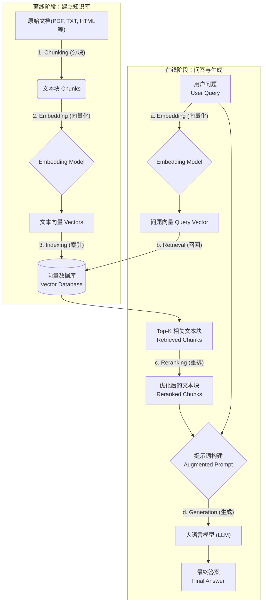
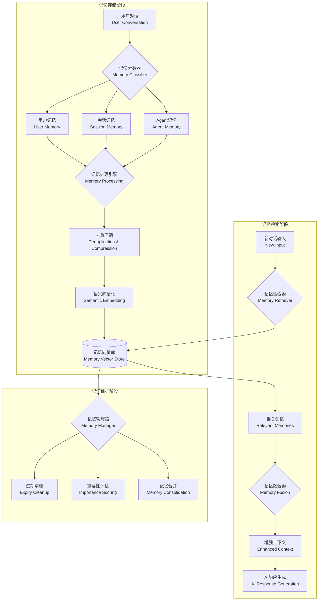
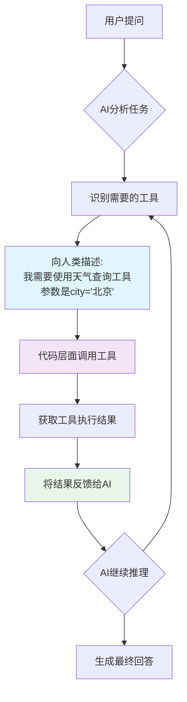
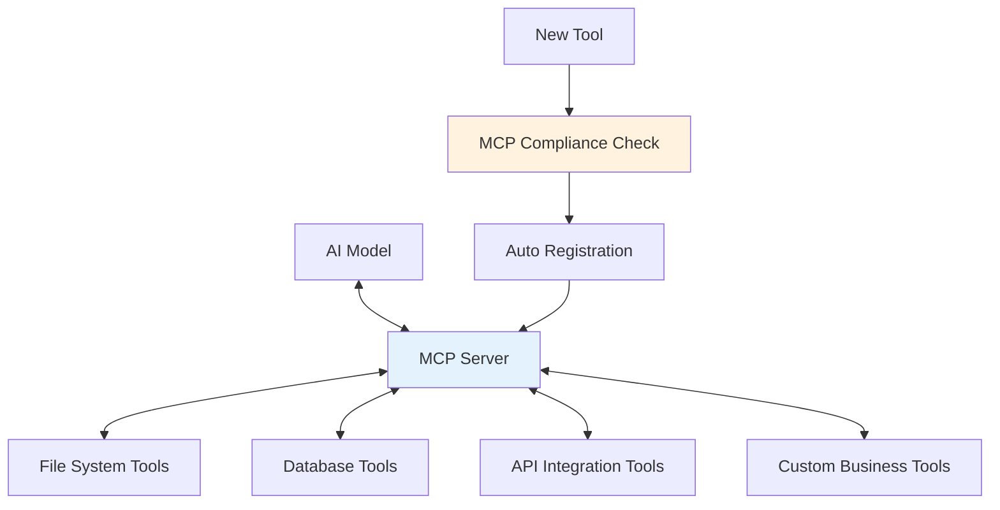
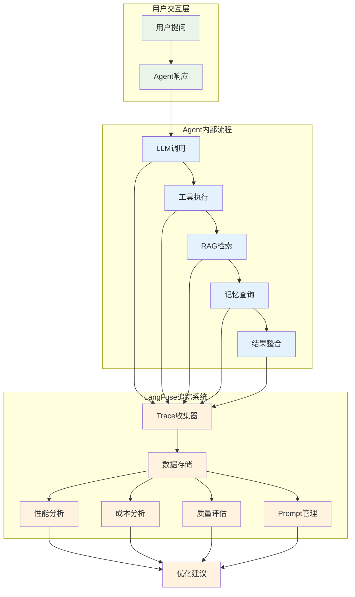

# AI Agent 应用开发技术分享

AI Agent是具备**记忆**、**工具调用**、**推理决策**和**自主执行**能力的智能系统，能够理解用户意图并自动完成复杂任务。

---

## 为什么需要AI Agent？

传统的ChatGPT式对话有三个核心限制：
- **无记忆**：每次对话都是独立的，无法记住之前的交互
- **无工具**：只能基于训练数据回答，无法获取实时信息或执行操作
- **无行动**：只能被动回答问题，无法主动规划和执行复杂任务

AI Agent正是为了突破这些限制而诞生的！

---

## 一、核心技术栈解析

### 🤖 大语言模型服务 (LLM Service)
**解决的问题**：如何统一管理多个AI模型，让应用能够灵活切换？

**核心原理**：
- 提供统一的API接口，屏蔽不同模型供应商的差异
- 支持OpenAI、Anthropic等多家供应商
- 根据任务复杂度智能选择最适合的模型

**实际价值**：
- 避免供应商锁定，降低成本风险
- 不同任务使用不同模型，性价比最优
- 一次开发，多模型通用

```python
# 简单示例：统一接口调用不同模型
llm_service.chat("分析数据", model="gpt-4o")        # 复杂任务
llm_service.chat("简单问答", model="gpt-4o-mini")   # 简单任务，成本更低
```

### 📚 RAG检索增强生成 (RAG Service)


RAG是一种将大型语言模型（LLM）的强大生成能力与外部知识库的实时、准确信息相结合的技术框架。您可以把它想象成 **给AI一个可以随时查阅的、专属的“开卷考试”资料库**，而不是让它仅凭自己记忆（预训练知识）来回答问题。

这极大地解决了LLM的两个核心痛点：
1.  **知识幻觉（Hallucination）**：让AI具备私有知识，而不仅仅依赖训练数据
2.  **知识过时（Outdated Knowledge）**：LLM的知识截止于其训练日期。

RAG可以分为两个主要阶段：

1.  **数据准备/索引阶段（Offline Phase - 离线阶段）**：这个阶段是预处理，目的是建立一个可供检索的知识库。这个过程只需要在知识源发生变化时执行一次或定期更新。
2.  **推理/生成阶段（Online Phase - 在线阶段）**：这个阶段是当用户提出问题时，实时发生的过程。它会查询知识库，并将检索到的信息与用户问题一起交给LLM来生成最终答案。

让我们用一张图来描绘这个过程：



---

#### **第一阶段：数据准备/索引 (Offline Phase)**

这个阶段的目标是把你的原始资料（如公司内部文档、产品手册、网页、书籍等）转换成AI可以理解和快速检索的格式。

##### **1. Chunking (分块/切片)**

*   **是什么？**
    将长篇的、非结构化的文档（如一个几百页的PDF）切分成更小的、有意义的文本片段（Chunks）。

*   **为什么需要？**
    *   **上下文限制**：LLM和Embedding模型都有输入的Token数量限制。一个完整的长文档通常会超出这个限制。
    *   **检索精度**：小的、主题集中的文本块在被向量化后，其语义信息更精确。如果一个大文档包含多个主题，它的整体向量可能会变得“模糊”，导致检索效果不佳。
    *   **处理效率**：处理小文本块比处理整个大文档更快、更节省资源。

*   **常见策略：**
    *   **固定大小分块 (Fixed-size Chunking)**：最简单的方法，按固定字符数（如1000个字符）切分。通常会设置一个重叠部分（`overlap`），比如200个字符，以确保句子或段落的完整性不会在切分点被完全破坏。
    *   **递归字符分块 (Recursive Character Text Splitting)**：更智能的方法。它会尝试按一系列分隔符（如`\n\n`段落、`\n`换行、`.`句号、` `空格）来切分，优先使用能保持文本结构完整性的分隔符。
    *   **内容感知分块 (Content-aware Chunking)**：最高级的方法。根据文档的结构来切分，比如按Markdown的标题（`#`, `##`）、HTML的标签（`<p>`, `<div>`）或者JSON的键值对来切分。这种方法能最好地保留文本的逻辑结构。

##### **2. Embedding (向量化)**

*   **是什么？**
    使用一个**Embedding模型**（如OpenAI的`text-embedding-ada-002`，或开源的`bge-large-zh`等）将每个文本块（Chunk）转换成一个高维的数字向量（一长串浮点数，例如[0.01, -0.23, ..., 0.98]）。

*   **为什么需要？**
    *   **语义捕捉**：这个向量捕捉了文本块的**语义含义**。在向量空间中，意思相近的文本块，它们的向量在空间中的位置也更接近。
    *   **机器可计算**：计算机不理解文字，但能高效地计算数字。向量化使得我们可以通过数学运算（如计算向量间的距离或角度）来比较文本的相似度。

##### **3. Indexing & Storage (索引与存储到向量数据库)**

*   **是什么？**
    将上一步生成的文本向量，连同其对应的原始文本块，一起存储到一个专门的数据库中——**向量数据库 (Vector Database)**。

*   **为什么需要？**
    *   **高效检索**：当有数百万甚至数十亿个向量时，传统的数据库无法进行快速的相似度搜索。向量数据库使用特殊的索引算法（如HNSW、IVF-PQ、FAISS）来组织向量，可以实现毫秒级的**近似最近邻（ANN）**搜索。
    *   **可扩展性**：向量数据库被设计用来处理海量向量数据，并支持元数据过滤、水平扩展等高级功能。

*   **常见的向量数据库：**
    *   **云服务**：Pinecone, Weaviate, Zilliz Cloud
    *   **开源/自托管**：Milvus, Qdrant, ChromaDB, FAISS (Facebook AI Similarity Search, 这是一个库，常被集成到其他系统中)

---

#### **第二阶段：推理/生成 (Online Phase)**

这个阶段是用户与系统交互时实时发生的。

##### **a. Query Embedding (用户问题向量化)**

当用户输入一个问题时（例如，“我们的A产品保修期是多久？”），系统会使用**与第一阶段完全相同的Embedding模型**，将这个问题也转换成一个向量（Query Vector）。

**关键点**：必须使用同一个模型，这样问题向量和文本块向量才能在同一个语义空间中进行有意义的比较。

##### **b. Retrieval (召回)**

*   **是什么？**
    系统拿着**问题向量**，去向量数据库中进行**相似度搜索**，找出与问题向量最“接近”的`K`个文本块向量。这个过程就是“召回”。

*   **如何工作？**
    向量数据库会计算问题向量与数据库中所有文本块向量的相似度（常用算法是**余弦相似度 Cosine Similarity**），然后返回得分最高的`K`个结果（比如`K=5`）。这5个文本块就是与用户问题最相关的知识片段。

*   **高级策略：**
    *   **混合搜索 (Hybrid Search)**：有时纯语义相似度不够，比如搜索特定的产品型号“X-2024”。混合搜索会结合向量搜索（语义）和传统的关键词搜索（词法），以获得更全面的结果。

##### **c. Reranking (重排) - 可选但推荐**

*   **是什么？**
    召回步骤（Retrieval）追求的是“快”和“广”，可能会返回一些不那么精确的结果。重排（Reranking）是一个更精细的筛选过程，用于对召回的`K`个文本块进行重新排序，把最相关的放在最前面。

*   **为什么需要？**
    *   **提升精度**：召回模型（Embedding Model）通常是双编码器（Bi-Encoder），独立地为问题和文本块编码。而重排模型通常是**交叉编码器（Cross-Encoder）**，它会同时看到（问题，文本块）对，从而能更精确地判断它们之间的相关性。
    *   **对抗“中间迷失”**：研究表明，LLM在处理长上下文时，对开头和结尾的信息关注度最高，中间部分的信息容易被忽略（Lost in the Middle）。通过重排，我们可以确保最关键的信息被放在提示词的最前面。

*   **如何工作？**
    一个Reranker模型会接收用户问题和每个召回的文本块，然后输出一个相关性分数（如0到1之间）。系统根据这个新分数对文本块重新排序，并可能只选择前`N`个（`N < K`）进入下一步。

##### **d. Prompt Augmentation (提示词构建/增强)**

这是RAG的核心魔法所在。系统会构建一个新的提示词（Prompt），这个提示词通常包含：
1.  **明确的指令 (Instruction)**：告诉LLM它的任务是什么。
2.  **上下文 (Context)**：将被召回并重排过的文本块作为背景知识。
3.  **用户问题 (Question)**：原始的用户问题。

**示例Prompt模板：**
```
---
请根据以下提供的上下文信息，用中文清晰地回答用户的问题。
如果上下文中没有足够的信息来回答问题，请直接说“根据我所掌握的资料，无法回答这个问题”。

[上下文信息]
{retrieved_and_reranked_chunks}

[用户问题]
{user_question}
---
```

##### **e. Generation (生成)**

最后，将这个**增强后的提示词**发送给大型语言模型（如GPT-4, Claude, Llama等）。LLM会基于你提供的上下文来生成一个既准确又有逻辑的答案。由于答案是“有据可查”的，所以它几乎不会出现幻觉，并且能回答关于最新知识的问题。

### 🧠 记忆 (Memory Service)

想象一下，如果你每次和朋友聊天都要重新自我介绍，朋友也完全不记得你们之前说过什么，这样的对话会多么尴尬和低效！传统的AI对话系统就是这样——每次对话都是"失忆"的全新开始。

记忆管理系统就是要给AI配备一个**"智能大脑"**，让它能够：
1. **记住你是谁**：你的偏好、习惯、历史对话
2. **记住对话上下文**：这次聊天的来龙去脉
3. **积累经验**：从每次交互中学习，变得更聪明

这不仅仅是简单的"存储聊天记录"，而是一个能够**智能组织、压缩、检索和关联**记忆的系统。

让我们看看基于Mem0.ai的记忆系统是如何工作的：


推荐rag与mem的实践好文：
https://km.sankuai.com/collabpage/2712022341?from=citadel_space_tree
---

#### **记忆的三个层次**

现实中，我们的大脑会将不同类型的记忆存储在不同的"区域"。AI的记忆系统也采用了类似的分层设计：

##### **🧑‍💼 用户记忆 (User Memory)**
*   **是什么？**  
    专门存储关于某个特定用户的长期信息，包括个人偏好、背景信息、重要的历史对话等。

*   **存储什么？**
    *   **个人偏好**：用户喜欢正式还是轻松的交流风格？偏爱哪种解决方案？
    *   **背景信息**：用户的工作角色、所在行业、技术水平等
    *   **重要决策**：用户做过的关键选择，避免重复询问
    *   **禁忌话题**：用户不希望讨论的内容或敏感问题

*   **实际价值**：
    ```
    场景：用户小王第一次问"推荐一个数据库"
    系统：为小王推荐了MySQL，并记住"小王偏爱简单易用的开源方案"
    
    两周后，小王问"推荐一个消息队列"
    系统：基于用户记忆，直接推荐RabbitMQ而不是复杂的Kafka
    ```

##### **💬 会话记忆 (Session Memory)**
*   **是什么？**  
    存储当前对话会话中的上下文信息，确保AI能够理解对话的连贯性和当前状态。

*   **存储什么？**
    *   **对话主题**：这次谈话的核心话题是什么？
    *   **讨论进度**：已经讨论了哪些方面？还有什么待解决？
    *   **临时偏好**：在这次对话中用户表现出的特定偏好
    *   **上下文状态**：当前正在分析什么项目？讨论哪个具体问题？

*   **实际价值**：
    ```
    会话开始：用户问"我想开发一个电商网站"
    系统记住：主题=电商开发，目标=网站建设
    
    中间对话：用户问"数据库用什么好？"
    系统理解：这是在电商网站语境下选择数据库，而不是泛泛而谈
    
    后续对话：用户问"还需要考虑什么？"
    系统知道：基于之前的电商+数据库讨论，推荐缓存、支付、物流等
    ```

##### **🤖 Agent记忆 (Agent Memory)**
*   **是什么？**  
    AI Agent自身的"经验积累"，记录在执行任务过程中学到的经验、模式和最佳实践。

*   **存储什么？**
    *   **成功案例**：哪些策略和方法在类似场景中效果好？
    *   **失败教训**：哪些做法需要避免？
    *   **优化经验**：在什么情况下应该调整策略？
    *   **领域知识**：在特定行业或场景中积累的专业洞察

*   **实际价值**：
    ```
    Agent经验：在处理技术咨询时，发现用户通常关心"性能、成本、学习难度"三个维度
    
    新用户咨询：问"推荐一个前端框架"
    Agent自动：基于经验，主动从性能、成本、学习难度三个角度对比React/Vue/Angular
    ```

---

#### **记忆系统的核心技术**

##### **1. 智能记忆提取 (Memory Extraction)**

*   **挑战**：不是所有对话内容都值得记住。如何从海量对话中提取真正有价值的信息？

*   **Mem0的解决方案**：
    *   **关键信息识别**：使用LLM分析对话，识别哪些是重要的决策、偏好或事实
    *   **情感和意图理解**：不仅记住用户说了什么，还记住用户的态度和真实意图
    *   **去噪过滤**：自动过滤掉礼貌用语、无关闲聊等噪音信息

*   **示例**：
    ```
    原始对话：
    "嗯，我觉得React还不错，虽然学习曲线有点陡峭，但是我们团队比较喜欢它的灵活性，
     而且社区支持也很好。Vue虽然简单，但感觉有点太轻量了。"
    
    提取的记忆：
    - 用户偏好：React > Vue
    - 团队特点：重视灵活性和社区支持
    - 能力水平：能够应对较陡峭的学习曲线
    - 决策因素：灵活性 > 简单性
    ```

##### **2. 记忆去重与压缩 (Memory Deduplication & Compression)**

*   **挑战**：用户可能多次表达相似的观点，如何避免重复存储，同时保持信息的完整性？

*   **技术实现**：
    *   **语义去重**：使用向量相似度检测重复或矛盾的记忆
    *   **信息合并**：将多次对话中的相似信息合并成更完整、更准确的记忆
    *   **时间衰减**：较新的信息会覆盖或更新较旧的相似记忆

*   **示例**：
    ```
    第1次对话：用户说"我比较喜欢简单的解决方案"
    第3次对话：用户说"我们团队偏爱容易上手的技术"
    第5次对话：用户说"复杂的框架我们用不来"
    
    压缩后的记忆：
    "用户/团队强烈偏好简单、容易上手的技术方案，避免复杂框架"
    ```

##### **3. 语义记忆搜索 (Semantic Memory Retrieval)**

*   **技术原理**：将记忆内容向量化后存储，当需要回忆时，通过语义相似度搜索最相关的记忆片段。

*   **超越关键词匹配**：
    ```
    用户新问题："这个项目适合用什么架构？"
    
    关键词搜索：可能找不到包含"架构"的历史记忆
    语义搜索：能找到"用户偏爱微服务而非单体应用"的相关记忆
    ```

*   **上下文感知**：系统不仅基于问题内容检索记忆，还会考虑当前对话的上下文，找到最相关的记忆。

##### **4. 记忆重要性评分 (Memory Importance Scoring)**

*   **自动评估**：Mem0会为每个记忆片段分配重要性分数，决定：
    *   哪些记忆应该优先保留？
    *   哪些记忆可以在存储空间不足时被清理？
    *   检索时应该优先返回哪些记忆？

*   **评分因素**：
    *   **频率**：被多次提及或确认的信息更重要
    *   **情感强度**：用户表现出强烈偏好或反感的内容更重要
    *   **决策相关性**：影响用户决策的信息更重要
    *   **时效性**：较新的信息通常比较旧的更重要

---

#### **Mem0的技术优势**

*   **零配置记忆**：开箱即用，不需要复杂的记忆模板配置
*   **自动记忆管理**：自动处理记忆的创建、更新、删除和整理
*   **跨会话持久化**：记忆在不同对话会话间持续存在
*   **多模态记忆**：支持文本、结构化数据等多种记忆类型
*   **隐私保护**：支持记忆的分级访问控制和数据脱敏

### 🛠️ 工具调用 (Tool Service)

想象一下，如果你有一个超级聪明的助理，但他只能坐在办公室里思考和说话，不能打电话、不能查资料、不能操作电脑，那这个助理的价值就大打折扣了。传统的AI就是这样——虽然能够理解和生成文本，但无法与现实世界交互。

工具调用系统就是要给AI配备一套**"数字化的手脚"**，让它能够：
1. **获取实时信息**：搜索网络、查询数据库、获取API数据
2. **处理复杂计算**：数学运算、数据分析、文档处理
3. **执行实际操作**：发送通知、创建文件、调用外部服务
4. **与外界交互**：控制设备、访问系统、操作应用

---

#### **工具调用的本质原理**

工具调用并不神秘，其核心是一个简单而优雅的**"人机协作"**模式：



这个过程的**核心洞察**是：**AI不需要知道如何执行工具，它只需要知道什么时候用什么工具，以及如何描述工具的使用方式**。

具体来说，整个流程包含四个关键步骤：

##### **步骤1：工具描述 (Tool Description)**
向AI说明有哪些工具可用，每个工具能做什么，需要什么参数。

```
示例工具描述：
名称：get_weather
功能：查询指定城市的天气信息
参数：
  - city (必需): 城市名称，如"北京"、"上海"
  - date (可选): 日期，默认为今天
返回：包含温度、湿度、天气状况的文本描述
```

##### **步骤2：工具选择 (Tool Selection)**
AI基于用户问题，决定需要使用哪个工具，并生成调用参数。

```
用户问："北京明天天气怎么样？"

AI推理：
1. 这是一个天气查询问题
2. 需要使用 get_weather 工具
3. 参数：city="北京", date="明天"
```

##### **步骤3：工具执行 (Tool Execution)**
代码层面接收AI的指令，实际调用工具，获取结果。

```
代码执行：
result = get_weather(city="北京", date="明天")
# 返回：{"temperature": "15°C", "condition": "多云", "humidity": "65%"}
```

##### **步骤4：结果整合 (Result Integration)**
将工具执行结果返回给AI，AI基于结果生成用户友好的回答。

```
AI收到工具结果后：
"根据查询结果，北京明天天气为多云，气温15°C，湿度65%。建议您出门时带上外套。"
```

---

#### **工具调用技术的演进历程**

工具调用技术经历了三个重要发展阶段，每个阶段都解决了前一阶段的核心问题：

##### **第一代：Function Calling (函数调用)**
*时间线：2023年初 - 2023年中*

**技术特点**：
- 由OpenAI率先推出，GPT-3.5/GPT-4原生支持
- 工具以JSON Schema形式描述
- AI返回结构化的函数调用请求
- 简单直接，但相对受限

**工作原理**：
```json
// 工具描述
{
  "name": "get_weather",
  "description": "查询天气信息",
  "parameters": {
    "type": "object",
    "properties": {
      "city": {"type": "string", "description": "城市名称"}
    },
    "required": ["city"]
  }
}

// AI返回
{
  "function_call": {
    "name": "get_weather", 
    "arguments": '{"city": "北京"}'
  }
}
```

**优势**：
- 标准化程度高，OpenAI官方支持
- 返回格式固定，解析简单
- 与GPT模型深度集成

**局限性**：
- 只支持单一函数调用
- 工具描述格式相对固化
- 缺乏复杂工具链支持

##### **第二代：Tools (工具生态)**
*时间线：2023年中 - 2024年初*

**技术突破**：
- 支持多工具并行调用
- 更灵活的工具描述方式
- 支持工具链和工具依赖
- 各家厂商开始标准化

**工作原理**：
```json
// 支持多工具调用
{
  "tool_calls": [
    {
      "id": "call_1",
      "type": "function",
      "function": {"name": "get_weather", "arguments": '{"city": "北京"}'}
    },
    {
      "id": "call_2", 
      "type": "function",
      "function": {"name": "calculate_distance", "arguments": '{"from": "北京", "to": "上海"}'}
    }
  ]
}
```

**核心改进**：
- **并行执行**：一次可以调用多个工具
- **工具ID跟踪**：每个工具调用有唯一标识
- **错误处理**：支持部分工具失败的情况
- **生态丰富**：LangChain、CrewAI等框架开始支持

**应用扩展**：
- 支持更复杂的业务场景
- 工具间可以有依赖关系
- 开始支持自定义工具开发

##### **第三代：MCP (Model Context Protocol)**
*时间线：2024年中至今*

**革命性变化**：
- Anthropic主导的开放标准
- 统一的工具协议规范
- 支持实时双向通信
- 面向企业级应用设计

**核心理念**：
MCP不仅仅是工具调用，而是一个**完整的上下文协议**，让AI能够：
- **动态发现工具**：运行时发现新的可用工具
- **持续对话**：工具执行过程中可以与AI保持交互
- **上下文感知**：工具能够理解当前对话的完整上下文
- **标准化接入**：任何符合MCP标准的工具都能无缝接入

**技术架构**：


**MCP的核心优势**：

1. **标准化**：统一的协议规范，避免了各家自建生态
2. **可扩展性**：新工具可以动态注册，无需重启系统
3. **企业友好**：支持权限控制、审计日志、安全隔离
4. **开发便利**：提供标准SDK，降低工具开发门槛

**实际应用示例**：
```
// MCP工具自动发现
用户："帮我分析这个Excel文件"

MCP流程：
1. AI向MCP Server查询: "有哪些文件分析工具？"
2. MCP Server返回: ["excel_analyzer", "csv_processor", "data_visualizer"]
3. AI选择: "我需要excel_analyzer工具"
4. MCP Server: "工具已就绪，需要什么参数？"
5. AI提供参数，MCP执行工具，返回结果
6. 整个过程对用户透明
```

---

#### **三代技术的对比总结**

| 特性维度 | Function Calling | Tools | MCP |
|---------|------------------|--------|-----|
| **调用方式** | 单函数调用 | 多工具并行 | 动态协议通信 |
| **工具发现** | 静态预定义 | 静态注册 | 动态发现 |
| **标准化程度** | OpenAI专属 | 框架各异 | 行业统一标准 |
| **企业应用** | 原型验证 | 小规模生产 | 大规模企业级 |
| **开发复杂度** | 简单 | 中等 | 标准化简单 |
| **生态成熟度** | 较成熟 | 成熟 | 快速发展中 |


### 📊 Trace与prompt调优 (Monitoring & Optimization)

想象一下，如果你是一家餐厅的老板，但你完全不知道：
- 顾客点了什么菜？
- 厨师做菜用了多长时间？
- 哪道菜最受欢迎？
- 哪个环节出了问题导致顾客不满？

没有这些信息，你怎么可能把餐厅经营好？

AI Agent的运营也是一样的道理。当用户与Agent交互时，背后可能发生了：
1. **多轮对话**：用户问题 → AI分析 → 工具调用 → 结果整合 → 最终回答
2. **复杂推理**：多个LLM调用、RAG检索、记忆查询、工具执行
3. **成本消耗**：每次调用都在花钱，但你不知道钱花在哪里
4. **质量问题**：用户不满意，但你不知道是哪个环节出了问题

**Trace与prompt调优系统**就是要给AI Agent配备一套**"全方位的体检设备"**，让你能够：
- **看清全貌**：每次交互的完整调用链路
- **找到瓶颈**：哪个环节慢？哪个环节贵？
- **优化效果**：A/B测试不同的prompt策略
- **持续改进**：基于真实数据不断优化Agent性能

---

#### **LangFuse：AI Agent的"黑匣子"**

LangFuse就像飞机的黑匣子一样，能够完整记录AI Agent运行过程中的每一个细节。但它不仅仅是记录，更是一个强大的**分析和优化平台**。


langfuse踩坑小文档
https://km.sankuai.com/collabpage/2714570719?searchid=179546343473&from=citadel_search_card
---

#### **Trace追踪：看清AI Agent的"思维过程"**

Trace就像给AI Agent的思维过程拍了一部"慢动作电影"，让你能看清每一个环节。

##### **什么是Trace？**

Trace是一次完整用户交互的**调用链记录**。一个Trace可能包含：

```
📋 Trace: "帮我分析销售数据"
├── 🧠 LLM调用1: 理解用户意图 (耗时: 800ms, 成本: $0.002)
├── 🔍 RAG检索: 查找相关文档 (耗时: 200ms, 命中率: 85%)
├── 🛠️ 工具调用: 数据库查询 (耗时: 1500ms, 返回: 1247条记录)
├── 🧠 LLM调用2: 数据分析 (耗时: 1200ms, 成本: $0.008)
├── 🛠️ 工具调用: 图表生成 (耗时: 300ms)
└── 🧠 LLM调用3: 结果总结 (耗时: 600ms, 成本: $0.003)

总计: 耗时4.6秒, 成本$0.013, 用户满意度: 4.2/5
```

##### **Trace的核心价值**

**1. 性能瓶颈识别**
```
发现问题：用户抱怨Agent响应太慢
Trace分析：数据库查询占用了总时间的32%
优化方案：添加数据库索引，响应时间减少60%
```

**2. 成本优化分析**
```
发现问题：月度AI费用超预算50%
Trace分析：GPT-4调用占总成本的80%，但其中60%是简单任务
优化方案：简单任务改用GPT-4o-mini，成本减少40%
```

**3. 质量问题诊断**
```
发现问题：用户反馈Agent回答不准确
Trace分析：RAG检索的相关性分数偏低(0.6)，阈值设置有问题
优化方案：调整检索阈值到0.75，准确率提升25%
```


#### **Prompt调优：让AI Agent更聪明**

如果说Trace是"诊断工具"，那么Prompt调优就是"治疗方案"。通过科学的方法不断优化prompt，让Agent变得更聪明、更准确、更高效。

##### **Prompt版本管理**

LangFuse提供强大的prompt版本管理功能，让你可以像管理代码一样管理prompt：

```
📝 Prompt版本历史

v1.0 (基础版)：
"你是一个数据分析助手，请分析用户提供的数据"
↓ 效果：准确率75%，但经常格式不统一

v2.0 (结构化版)：  
"你是专业的数据分析师。请按以下格式分析数据：
1. 数据概览
2. 关键发现  
3. 具体建议
4. 行动计划"
↓ 效果：准确率85%，格式统一，但有时过于冗长

v3.0 (精简优化版)：
"作为数据分析专家，请用简洁专业的方式分析数据。
重点关注：趋势变化、异常值、业务影响。
输出格式：概览→发现→建议(每部分不超过3条要点)"
↓ 效果：准确率90%，简洁明了，用户满意度4.6/5 ✅
```

##### **A/B测试与效果对比**

LangFuse支持prompt的A/B测试，让你能够科学地比较不同版本的效果：

```
🧪 A/B测试: "客户服务Agent的回复风格"

版本A (正式风格):
"感谢您的咨询。根据您的情况，我建议您采取以下措施..."

版本B (亲切风格):  
"很高兴为您服务！针对您的问题，我为您想了几个解决方案..."

测试结果 (1000次交互):
                 版本A    版本B
用户满意度        4.2/5    4.7/5  ✅
问题解决率        85%      88%    ✅  
平均对话轮数      3.2轮    2.8轮  ✅
投诉率           2.3%     1.1%   ✅

结论：版本B在所有维度都表现更好，全面推广！
```


## 二、三大Agent开发框架

### 🎯 LangChain ReAct Agent
**设计哲学**：推理-行动循环，模拟人类解决问题的思维过程

**核心流程**：
1. **Reason**（推理）：分析问题，制定计划
2. **Act**（行动）：调用工具执行具体操作
3. **Observe**（观察）：分析执行结果
4. 循环直到问题解决

**适用场景**：
- 需要多步推理的复杂问题
- 工具调用密集的任务
- 对推理过程要求透明的场景

**生态优势**：LangChain拥有丰富的工具库和社区支持

### 🚀 Dify Agent
**设计哲学**：低代码平台，让非技术人员也能构建AI应用

**核心特色**：
- **可视化编排**：拖拽式工作流设计
- **预置模板**：开箱即用的行业解决方案
- **企业级功能**：权限管理、审计日志、负载均衡

**技术架构**：
- 前端：可视化配置界面
- 后端：工作流引擎 + API服务
- 我们的集成：通过API调用，享受平台能力

**适用场景**：
- 业务场景相对固定的应用
- 需要快速上线的MVP产品
- 非技术团队主导的项目

### 🚁 CrewAI Multi-Agent
**设计哲学**：团队协作，让多个专业Agent分工合作

**角色分工体系**：
- **研究员**：负责信息收集和初步分析
- **分析师**：深度数据分析和洞察发现
- **作家**：内容创作和表达优化
- **协调员**：统筹规划和质量把控
- **审查员**：最终检查和优化完善

**协作模式**：
- **Sequential**（顺序执行）：适合有明确先后顺序的任务
- **Hierarchical**（层级管理）：适合复杂的项目管理场景

**技术创新**：
- 共享记忆池：团队成员可以共享知识和经验
- 智能任务分解：自动将复杂任务分解为子任务
- 质量控制机制：多Agent交叉验证，提高输出质量

---

## 三、框架技术栈融合之道

### 统一技术底座的价值

**问题**：三种框架各有优势，但如何避免重复建设？

**解决方案**：构建统一的核心服务层，让所有框架共享基础能力

```
┌─────────────────────────────────────┐
│  LangChain  │   Dify    │  CrewAI   │  ← Agent框架层
├─────────────────────────────────────┤
│      统一的核心服务层                  │  ← 技术复用层
│ LLM │ RAG │ Memory │ Tools │ Monitor│
├─────────────────────────────────────┤
│        外部API和基础设施              │  ← 基础设施层
└─────────────────────────────────────┘
```

### 技术融合的实际效果

**1. LLM服务统一调用**
- 三种框架都使用相同的模型管理服务
- 统一的成本控制和性能监控
- 模型切换无需修改上层业务逻辑

**2. RAG能力无缝集成**
- LangChain：程序化调用RAG检索
- Dify：平台配置知识库，自动RAG
- CrewAI：将RAG封装为专用工具

**3. 记忆系统协同工作**
- 跨框架记忆共享，用户体验一致
- 分层记忆设计，支持不同粒度的记忆需求
- 统一的记忆管理策略

**4. 监控数据统一采集**
- 所有框架的调用都被统一监控
- 完整的调用链路追踪
- 统一的性能和成本分析

---

## 四、最佳实践与选型建议

### 框架选择决策树

```
开始选型
    │
    ├─ 团队技术实力如何？
    │   ├─ 技术团队主导 → 考虑LangChain或CrewAI
    │   └─ 业务团队主导 → 选择Dify
    │
    ├─ 任务复杂度如何？
    │   ├─ 简单单步任务 → LangChain ReAct
    │   ├─ 复杂多步任务 → CrewAI Multi-Agent
    │   └─ 标准业务流程 → Dify
    │
    └─ 上线时间要求？
        ├─ 快速上线 → Dify
        ├─ 原型验证 → LangChain
        └─ 精品项目 → CrewAI
```